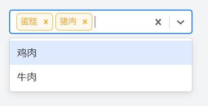

# 多选下拉框

技术选型：react-select

npm地址：https://www.npmjs.com/package/react-select

官网自定义样式：https://react-select.com/styles



实现代码

```js
import React, { useState } from "react";
import ReactSelect from "react-select";

const ReactSelectDemo = () => {
    const [value, setValue] = useState([]);
    const options = [
        { label: "蛋糕", value: "蛋糕"},
        { label: "猪肉", value: "猪肉"},
        { label: "鸡肉", value: "鸡肉"},
        { label: "牛肉", value: "牛肉"},
    ];

    return (
        <ReactSelect
            options={options}
            isMulti
            styles={{
                multiValue: (base) => ({
                    ...base,
                    border: `1px solid #FFA814`,
                    backgroundColor: '#FFF8EC',
                    borderRadius: 6
                }),
                multiValueLabel: (base) => ({
                    ...base,
                    color: '#FFA814',
                }),
                multiValueRemove: (base) => ({
                    ...base,
                    color: '#FFA814',
                    ':hover': {
                        backgroundColor: '#FFA814',
                        color: 'white',
                    },
                }),
            }}
            onChange={(value) => setValue(value)}
            value={value}
            placeholder={"请选择..."}
        />
    );
}

export default ReactSelectDemo;
```

